# RLVR Architecture & Process Flow

## High-Level System Architecture

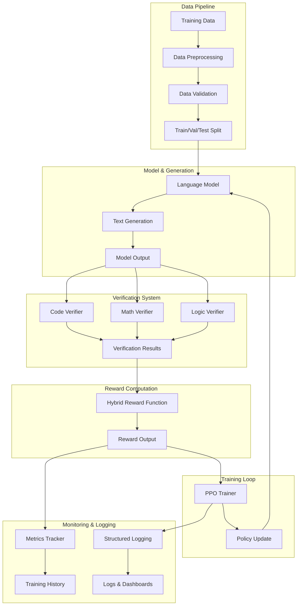

## Detailed Component Architecture

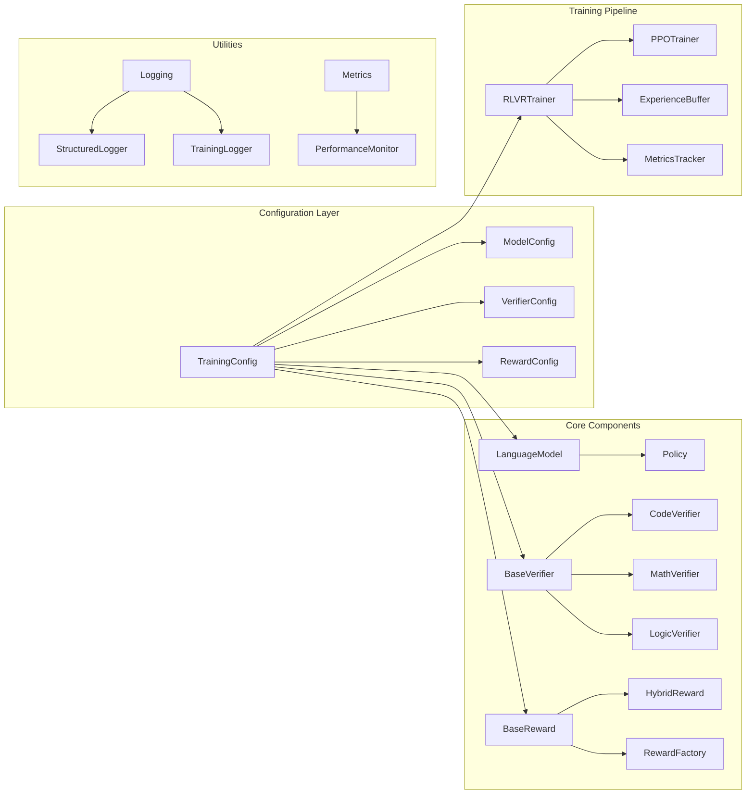

## RLVR Training Process Flow

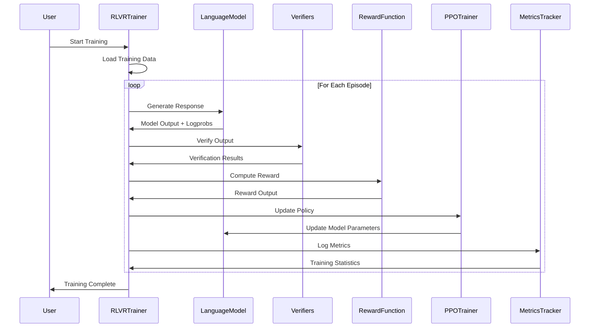

## Data Flow Architecture

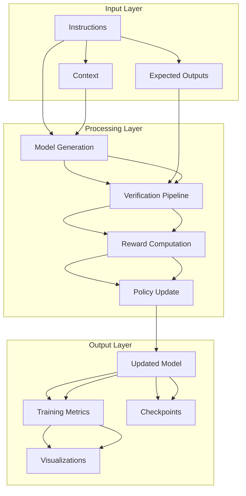

## Verification System Architecture

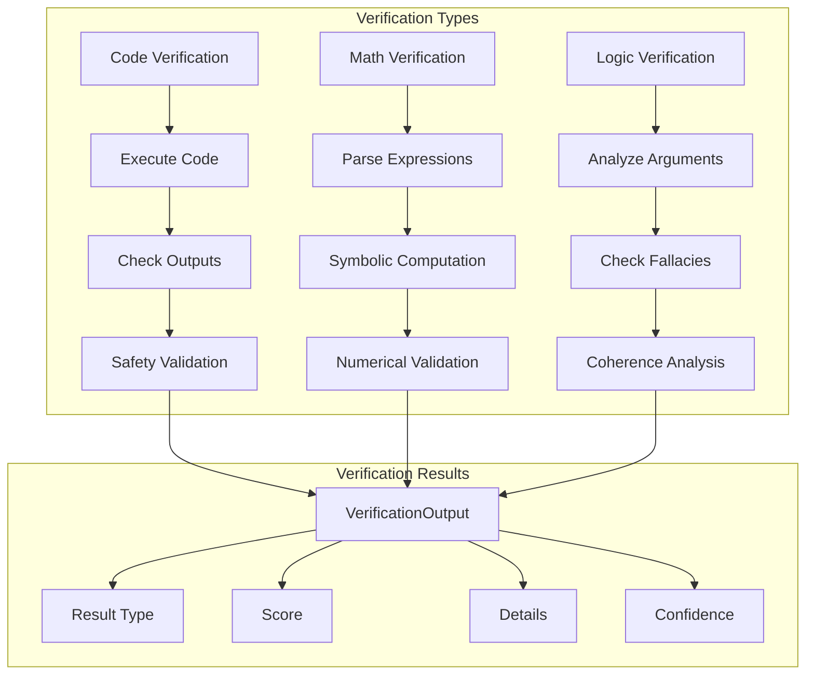

## Reward System Architecture

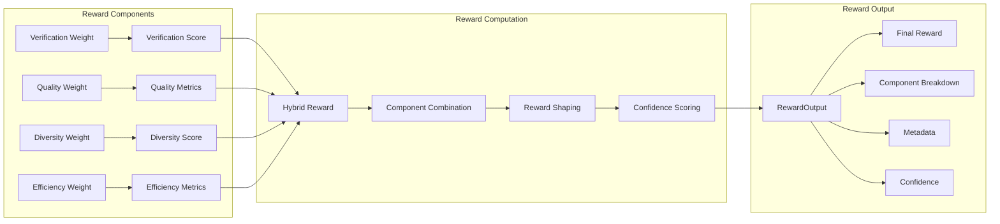

## Training Pipeline Architecture

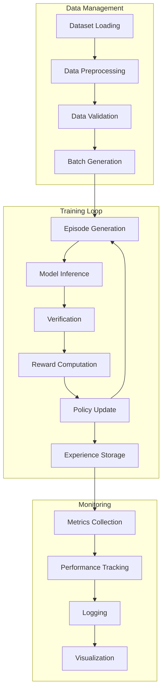

## Component Dependencies

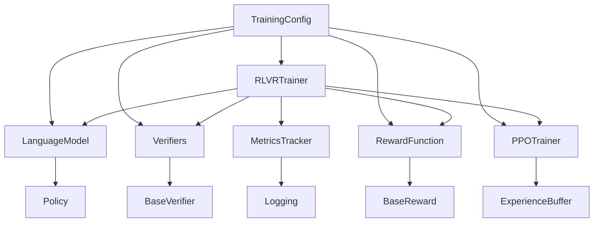

## File Structure Overview

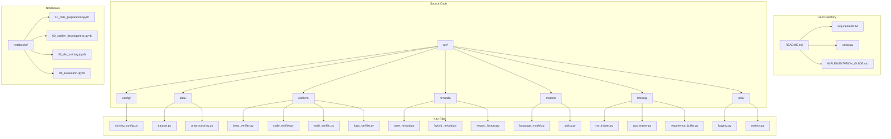

## Training Workflow

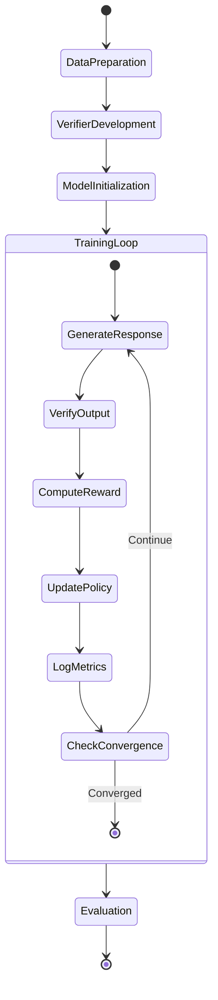

## Key Features Summary

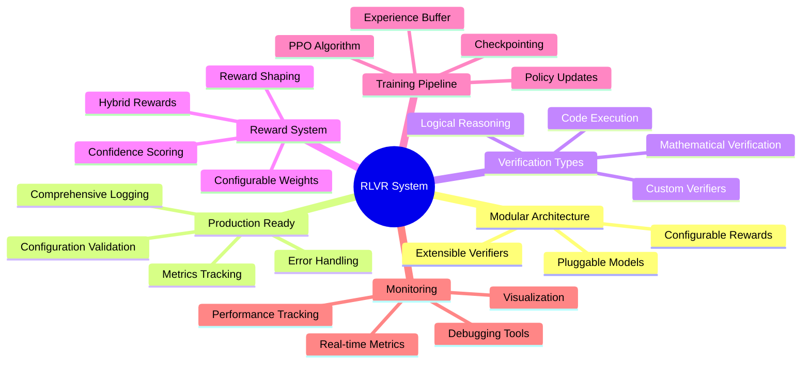
